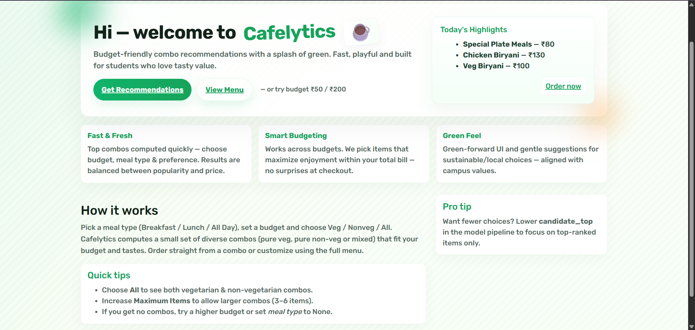
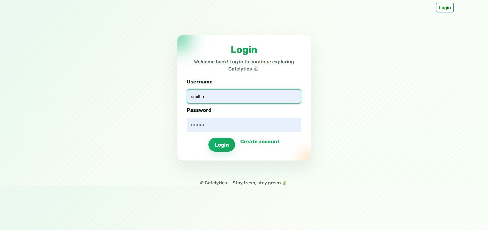
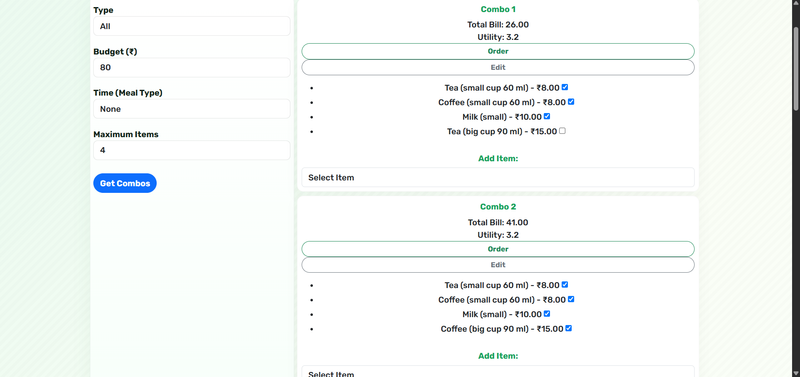
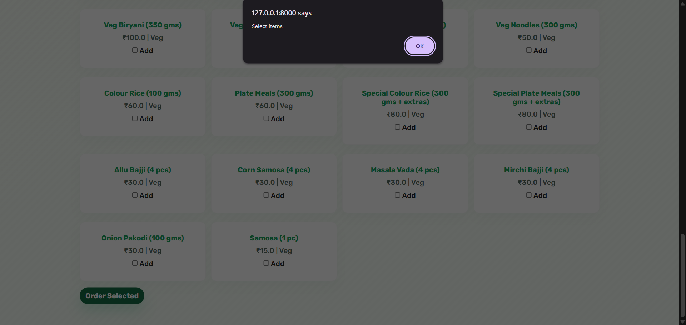

# 🍽️ Cafelytics – AI-Powered Smart Meal Recommendation & Canteen Analytics

> An intelligent canteen management platform that leverages Machine Learning to generate personalized, budget-friendly meal recommendations while providing data-driven analytics for smarter food planning and inventory management.


---

# 📸 Project Preview



---

# 📖 Overview

Cafelytics is an AI-powered smart canteen management platform developed using **Django**, **Machine Learning**, and **Data Analytics**. The system recommends affordable meal combinations based on a user's **budget**, **dietary preference (Veg/Non-Veg)**, and **meal type**, while helping administrators analyze food demand and customer preferences.

Unlike traditional canteen systems that only handle ordering, Cafelytics integrates a **Random Forest-based recommendation engine** to generate intelligent meal combinations and improve decision-making using real-world data.

---

# 🎯 Problem Statement

Traditional canteen management systems primarily focus on billing and order management. They lack:

- Personalized meal recommendations
- Budget-aware suggestions
- Demand analytics
- Customer preference tracking
- Data-driven decision making

Cafelytics addresses these challenges by combining **Machine Learning** with a modern web application to improve both the student experience and canteen operations.

---

# 🌐 Live Demo

🚀 Deployment in progress.

The application will be hosted on **Render**.

---

# ✨ Features

## 👨‍🎓 Student Module

- Secure User Registration & Login
- Budget-Based Meal Recommendation
- Veg / Non-Veg Filtering
- Meal Type Selection
- AI-Generated Meal Combos
- Order Placement
- Dynamic Preference Updates

---

## 👨‍💼 Admin Module

- Manage Menu Items
- Monitor Student Preferences
- Analyze Food Demand
- Track Ordering Trends
- Update Meal Data

---

## 🤖 AI Features

- Random Forest-based Recommendation Engine
- Preference Score Prediction
- Budget Optimization
- Personalized Meal Recommendations
- Dynamic Recommendation Generation
- Continuous Learning through User Orders

---

# 🧠 Machine Learning Workflow

```text
Excel Dataset
        │
        ▼
Data Cleaning & Preprocessing
        │
        ▼
Feature Engineering
        │
        ▼
Random Forest Model
        │
        ▼
Preference Score Prediction
        │
        ▼
Budget-Aware Recommendation Engine
        │
        ▼
Smart Meal Combination Generation
```

---

# 🏗️ System Architecture

```text
                 Student
                    │
                    ▼
         Django Web Application
                    │
                    ▼
        Recommendation Engine
                    │
                    ▼
      Random Forest ML Model
                    │
                    ▼
            SQLite Database
                    │
                    ▼
 Personalized Meal Recommendations
```

---

# 🛠️ Tech Stack

| Category | Technologies |
|----------|--------------|
| Backend | Django 5 |
| Programming Language | Python 3.10 |
| Machine Learning | Scikit-Learn (Random Forest) |
| Data Processing | Pandas, NumPy |
| Database | SQLite |
| Frontend | HTML5, CSS3, Bootstrap, JavaScript |
| Data Source | Excel (.xlsx) |
| Deployment | Render (Planned) |

---

# 📂 Project Structure

```text
cafelytics/
│
├── cafelytics_proj/
├── canteen_app/
├── data/
├── Screenshots/
├── staticfiles/
├── build.sh
├── db.sqlite3
├── manage.py
├── requirements.txt
├── runtime.txt
├── render.yaml
└── README.md
```

---

# 📊 Dataset

The recommendation engine is trained using a structured dataset containing:

- Food Item
- Category
- Price
- Meal Type
- Availability
- Preference Score

The dataset is utilized for:

- Meal Recommendation
- Preference Score Prediction
- Demand Analytics
- Budget Optimization
- Combo Generation

---

# 📈 Results

- Successfully integrated Machine Learning into a Django web application.
- Generates personalized meal combinations based on user preferences.
- Supports budget-aware recommendations.
- Dynamically updates preference scores after each order.
- Provides meaningful analytics for canteen management.

---

# 📸 Application Screenshots

## 🏠 Home Page


---

## 🔐 Login Page



---

## 🍽️ AI Meal Recommendation



---

## ✅ Input Validation



---

# 🚀 Installation

Clone the repository

```bash
git clone https://github.com/Arpithasingh10/cafelytics.git
```

Move into the project directory

```bash
cd cafelytics
```

Install dependencies

```bash
pip install -r requirements.txt
```

Run database migrations

```bash
python manage.py migrate
```

Start the development server

```bash
python manage.py runserver
```

Visit

```text
http://127.0.0.1:8000/
```

---

# 🚀 Roadmap

Future improvements include:

- AI Chatbot for Food Suggestions
- QR Code Ordering
- Online Payment Gateway
- Cloud Database Integration
- Inventory Prediction
- Sales Forecasting
- Personalized User Profiles
- Admin Analytics Dashboard
- Real-Time Recommendation Updates

---

# ⭐ Project Highlights

- 🤖 AI-Powered Recommendation Engine
- 🍽️ Smart Meal Combination Generator
- 💰 Budget-Aware Meal Optimization
- 📊 Data-Driven Canteen Analytics
- 📈 Preference Score Prediction
- 🧠 Machine Learning Integration
- 🌐 Full-Stack Django Web Application
- 🗄️ SQLite Database Integration

---

# 📌 Project Status

✅ Completed

This project was developed as part of an **Artificial Intelligence & Machine Learning** academic initiative to demonstrate the practical application of Machine Learning in smart canteen management.

Deployment and future enhancements are planned.

---

# 👩‍💻 Developer

**Arpitha Singh**

B.Tech – Artificial Intelligence & Machine Learning

GitHub: https://github.com/Arpithasingh10

---

## ⭐ Support

If you found this project interesting, consider giving it a ⭐ on GitHub.

It helps others discover the project and motivates future improvements.